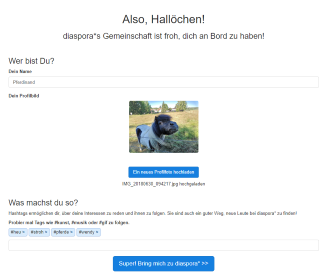
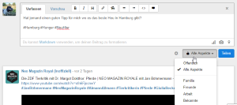
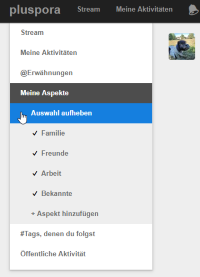
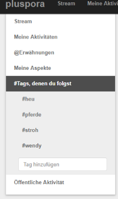
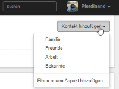
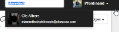

# Google+ macht dicht. Was nun?
Erst mal: Keine Panik. Es ist noch eine Menge Zeit um sich ein neues zu Hause zu suchen. Dieses Dokument soll Dich dabei unterstützen zu Diaspora* zu wechseln.

## Warum Diaspora*?
Diaspora* fühlt sich an vielen Stellen so ähnlich an wie Google+. Einiges wirst Du vermutlich vermissen, aber im Wesentlichen kann man schnell als Umsteiger anfangen. Und vor allem: Es sind schon einige Plusser da! \o/

## Alles klar. Wie fang ich da an?
Diaspora* arbeitet mit sogenannten Pods. Andere erklären das ausführlicher, jetzt ist erst einmal wichtig, dass Du DIr einen beliebigen Pod aussuchst. [PlusPora](http://www.Pluspora.com) wäre eine gute Anlaufstelle für Google+ - Wechsler. Klicke dort einfach auf "Konto erstellen und denke Dir einen Benutzernamen aus. Dann wirst Du durch folgende kleine Willkommensseite begrüßt:

Das Feld "Was machst Du so?" ist wichtig in Diaspora*. Was Du hier mit Hashtag einträgst bestimmt, was Du bei Diaspora* zu sehen bekommst. 

## Bin ich schon drin, oder was?
Ja. Bist Du. Das wirkt vielleicht anfangs etwas ungewohnt, aber Du kannst jetzt genauso los legen wie bei Google+. Schreib etwas, schau Dir andere Beiträge an.

## Wo sind meine Kreise?
Ok, Archimedes: Die gibt's hier nicht. Aber keine Panik. Die heißen nur anders. Bei Diaspora* heißen sie "Aspekte". Du kannst sie beim Schreiben eines neuen Beitrags auswählen oder auch auf der linken Seite Inhalte ausschließlich von diesen Aspekten anzeigen lassen:

## Ich seh aber kaum was
Du siehst nur das, was Du auch willst. Klappe auf der linken Seite "Tags denen Du folgst" auf. Hier kannst Du Deine Interessen eintragen und siehst dann im Stream, was andere zu diesen Themen so schreiben:

Diaspora* hat keine Communities oder Sammlungen. Die Hashtags sind hier das Mittel der Wahl. 
Deshalb ist es auch wichtig, dass Du selbst Hashtags verwendest, wenn andere das Lesen sollen was Du schreibst.

## Meine Kreise - äh.. Aspekte sind aber leer
Dann füg doch einfach jemanden hinzu! Zum einen kannst Du im Stream oder bei einem Kommentar auf den Namen des Verfassers klicken. Dann siehst Du nicht nur die Details, sondern kannst ihn auch zu Deinen Aspekten hinzufügen:

Vielleicht willst Du auch einfach schauen, ob jemand da ist, den Du kennst. Dann benutze einfach die Suche oben rechts:

Eine gute Idee sind übrigens die Hashtags #Neuhier und #GooglePlusRefugee. Die kannst Du übrigens auch oben in der Suche so eintippen. Damit findest Du recht schnell andere Leute, die von G+ umgezogen sind.

## Das wars auch schon. Schön, dass Du da bist!
Schreib fleißig, finde Deine Google+ - Kontakte wieder und mache Diaspora* zu einem lebendigen Ort. Wir freuen uns auf Dich

## Noch Fragen, Kienzle?
Stell sie einfach direkt in Diaspora*. Wenn Du den Hashtag "#Frage" benutzt, wird Dir meist schnell jemand auskennt.

---
Das Hintergrundbild stammt von [Herr(n) Ohlsen](https://www.flickr.com/photos/herrolsen/4663935727) (CC-BY-NC)

